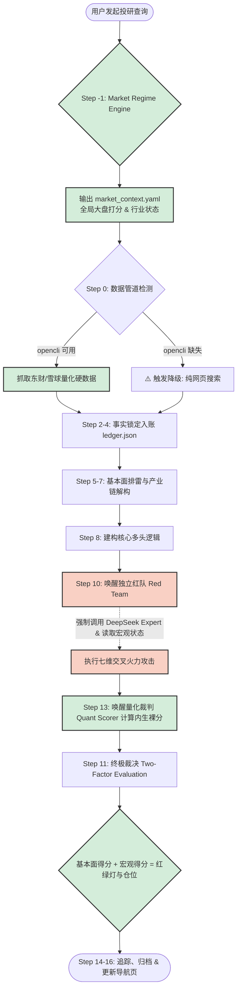

<div align="center">

# 🔎 机构级 A/H 股买方投研智能体 (Company Researcher)
### —— 个人投资者的专属量化与基本面决策中枢

**“不仅是发现好公司，更是发现好机会。用基本面看底，用资金面看顶。”**


</div>

---

## 📖 导读：写给自己的投研备忘录

_(注：本文档旨在为您提供全景式的决策逻辑速查表，防止在繁杂的市场信息中迷失最初的投研纪律。)_

在高度博弈的 A 股与港股市场，单纯套用“美股价值投资”往往会陷入价值陷阱。本系统放弃了虚假的“大模型盲目乐观”，通过严酷的**数据约束、红队攻击、交易纪律**三大模块，打造了一个专为实战买方设计的投研流水线。在 V4.1 版本中，系统全面升级，引入了**大盘气象站**与**行业状态机**，实现了“宏观环境 + 微观基本面”的双因子综合决策。

---

## 🌟 系统全景运行流程图 (Workflow)



---

## 🧠 第一篇：核心投研决策逻辑树

### 0. 宏观气象与行业状态 (V4.1 新增)
- **大盘气象站 (Market Regime Engine)**：通过两市成交额、融资余额等计算出 **0-100 的全局 Market Score**，判定当前市场处于 Risk On / Balanced / Risk Control / Risk Off 四大状态之一，决定整体策略进攻或防守。
- **行业状态机 (Sector Regime Engine)**：基于四大核心维度（价格趋势、资金流、盈利预期、估值与位置），结合A/H股特殊权重（A股重资金趋势，港股重估值盈利），将目标行业强制归类为：**主升浪、估值修复、资金博弈、衰退出清**。
- **双因子终极汇流**：报告最终将通过【基本面裸分】+【宏观环境得分】的碰撞来判定最终的红绿灯与仓位上限（例如：好公司 + 坏大盘 = 黄灯观望）。

### 1. 基本面排雷层 (Fundamental Filtering)

这是系统的“防御底线”，通过财报交叉验证，戳破“纸面富贵”：

- **净利润 vs 经营现金流**：利润大幅增长但现金流为负？系统将触发坏账或压货造假预警。
- **应收账款占比**：警惕账面营收极高但收不回现金的产业链弱势企业。
- **存货周转异常**：判断产品是否滞销或面临减值风险。

### 2. 资金与博弈层 (Capital Flow & Game Theory)

好公司如果筹码拥挤，就是毒药。系统强制加载资金博弈引擎（在 V4.1 中受宏观熔断强行管控）：

- **🟢 绿灯 (共振买入)**：基本面优异且无资金异动，大盘非冰点，允许正常建仓。
- **🟡 黄灯 (分歧观望)**：基本面优秀但遭遇大盘冰点，或个股资金温和流出，强制压降仓位上限至 5%，只出不进。
- **🔴 红灯 (共振卖出)**：资金大幅流出且伴随跌幅（<-4%），或基本面崩坏叠加宏观冰点。
- **排雷盲区**：系统已强制规避 HKSCC 代持席位的噪音，以及大股东减持期内的标的。

### 3. 交易制度与执行层 (Execution Discipline)

这是保障你不被 A 股机制“闷杀”的最后一道防线：

- **T+1 防守线**：严禁给出“次日开盘跌破 X 元止损”的纸上谈兵策略。必须采用“连续两日收盘跌破”等实盘可操作的物理止损法则。
- **14:30 尾盘决策制**：A 股盘中常有诱多，系统强制建议在 **14:30 之后观察盘口**。
- **极端流动性陷阱**：日均成交额 < 5000 万的标的，因存在跌停封死无法逃生的风险，一律拉黑。

---

## ⚖️ 第二篇：量化裁判打分与评级标准

系统内置量化裁判员，抛弃大盘干扰，**算出绝对客观的公司质地内生裸分（Intrinsic Score）**，严格按照分数锚定仓位。**严禁越界超配**。

|   评级   | 分数区间  | 核心含义                                                                         | 仓位上限 |
| :------: | :-------: | :------------------------------------------------------------------------------- | :------: |
| **S 级** | 90-100 分 | **强烈看多**。基本面与资金面形成共振，估值合理，且未触发任何红队致命降级。       | **25%**  |
| **A 级** | 80-89 分  | **优质资产但存在瑕疵**。可能面临估值偏高或短期资金分歧，建议采用左侧分批建仓法。 | **15%**  |
| **B 级** | 65-79 分  | **观望等待**。基本面表现平庸，或面临明显的短线资金压制。                         |  **5%**  |
| **C 级** | 50-64 分  | **无操作价值**。基本面或资金面明显走弱。                                         |  **0%**  |
| **D 级** |  <50 分   | **坚决清仓/规避**。触发“一票否决”或逻辑彻底崩盘，应立刻从自选股删除。            |  **0%**  |

🧨 **【一票否决死刑条件】（触发即 D 级，无视一切利好）**：

1. 大股东/董监高当前正处于减持计划期内。
2. 近一年内被证监会立案调查或面临退市风险。
3. 遭遇流动性枯竭（日均成交额 < 5000 万）。
4. 出现严重的“纸面富贵”（例如净利润与现金流发生灾难性背离）。
5. **[港股专属]** 大股东持股比例 > 70% 且近期频繁合股/供股/配股（老千股特征）。

---

## ⚔️ 第三篇：多智能体红队对抗 (Red Team)

系统最强大的“刺客”，用于打破投资者的确认偏误 (Confirmation Bias)。

### 🧠 强制外脑调用 (Reasoning Core)

红队智能体 (`Red_Team_Review_Agent`) **被剥夺了使用普通模型的权利**，它会在后台强制调用 `opencli deepseek ask --model expert --think true`。

- **运作方式**：利用 DeepSeek 专家模式长达数分钟的“思维链 (CoT) 自我推演”，寻找多头逻辑中的致命漏洞。
- **七维攻击框架**：在 **事实、逻辑、竞争、资金、宏观、估值、执行** 七个维度上，找到未来 3-6 个月内能被明确证实/证伪的风险节点。
- **宏观自适应火力 (V4.1 新增)**：红队会根据大盘状态动态转移火力（牛市重狙估值天花板与套现，熊市重狙现金流与坏账）。

---

## ⚙️ 第四篇：买方标准化流水线 (SOP)

为了防止分析过程发散，系统必须严格按照以下流水线作业（禁止跳步）：

| 阶段           | 步骤           | 核心动作说明                                                                       |
| :------------- | :------------- | :--------------------------------------------------------------------------------- |
| **感知宏观**   | **Step -1**    | 唤醒 Market_Regime_Agent，确立全局大盘打分与行业状态机，确立防守基调。 |
| **锁定数据**   | **Step 0-1**   | 强制执行 `opencli` 抓取硬数据。**【新增 Anti-Clutter 防污染纪律】**严禁在根目录生成临时垃圾文件，必须写入标的专属 `.cache/` 目录。检索历史调研档案，准备 Delta 对比。 |
| **事实入账**   | **Step 2-4**   | 提取核心数字写入 `ledger.json`，锁死底层数据，严防 AI 篡改。 |
| **行业与产业链**| **Step 5**     | **【模块化隔离】**强制读取 `context/industry_rules.md` 加载行业专属指标。输出 Mermaid 产业链流转图。 |
| **预期差定位** | **Step 6-7**   | 扫描主力资金，对比“市场一致预期”与“系统独立判断”，寻找定价错配。                   |
| **红蓝交锋**   | **Step 8-10**  | 建构 ≥5 条多头证据，随后唤醒 **红队智能体 (DeepSeek 推理内核)** 进行无情绞杀。**【格式锁定】**强制读取 `templates/report_template.md` 锁死排版。 |
| **终极决断**   | **Step 11-13** | **【强风控熔断】**强制加载 `context/regime_matrix.yaml`，若大盘恶劣则触发 `forbid_left_side_buy`，一票否决抄底动作。综合基本面与宏观得出红绿灯与仓位。 |
| **归档追踪**   | **Step 14-16** | **【防冗余命名铁律】**严格以 `[核心市场代码(A股优先)]_[标准中文简称]` 作为唯一目录名，杜绝A+H及中英文双开。将核心结果写入 `ledger.csv`，并根据板块进行物理归档，自动更新主导航页。 |

---

## ⚠️ 第五篇：系统降级与数据管道说明

由于个人投资者缺乏机构级的 Level-2 接口，本系统极度依赖外部数据管道，你需要了解以下限制：

- **完美模式**：系统正常检测到 `opencli` 命令行工具。此时 AI 能获取精确的主力资金净流入、十大流通股东、历史精准 K 线等硬数据，打分最严谨。
- **降级模式 (Fallback)**：如果系统未安装或无法调用 `opencli`，引擎将自动触发**“网页搜索兜底”**。
  - **影响**：失去精准的实时行情与资金流数据。
  - **惩罚**：在降级模式下产出的报告，其最终可信度评级将**自动强制扣减 1 星**，并在报告开头打印 `⚠️ 数据源降级` 警告。

---

## 🚀 第六篇：安装、配置与使用示例

### 1. 前置依赖安装 (必做)

本系统依赖 `opencli` 桥接深度的金融数据和 DeepSeek 专家推理模型，请在您的主机终端执行以下命令：

```bash
# 全局安装数据管道工具
npm i -g opencli

# 登录并验证各平台适配器（涵盖东财、雪球、DeepSeek等）
opencli auth login
```

### 2. 部署 Skill (如果尚未挂载)

将本技能库放入您的 AI Agent 全局定制化目录：

```bash
mkdir -p ~/.gemini/config/skills
cd ~/.gemini/config/skills/
git clone https://github.com/nihong/company-researcher.git
```

### 3. 实战使用示例 (Prompts)

安装完毕后，您可以直接用自然语言向您的智能体下达指令。系统会自动匹配并执行 SOP。

**🔥 示例 1：个股深度诊断（建议用于计划重仓的标的）**

> “帮我深度调研一下 宁德时代 (300750)，请严格执行红队攻击和量化打分，我要决定是否把它纳入明年的长线底仓。”

**🔥 示例 2：港股特化分析（自动切换港股逻辑）**

> “以买方视角分析 腾讯控股（0700.HK）的投资机会。注意核查其南向资金的定价权变动，以及当前的高股息溢价是否合理。”

**🔥 示例 3：复盘与追踪（二次调研）**

> “重新评估 贵州茅台 (600519)。我们上个月刚出过它的研报，请提取历史档案进行 Delta 对比，看看当时的红队预警现在是否已经兑现？”

---

## 📂 第七篇：架构地图与自定义优化指南

```text
company-researcher/
├── SKILL.md                  # 🌟 主干文件：包含流水线调度、评级仓位上限规则
├── README.md                 # 📖 备忘录：本文档说明书
├── context/
│   ├── regime_matrix.yaml    # 🌡️ 市场法则库：定义宏观状态的硬性惩罚、左侧禁买令等
│   └── industry_rules.md     # 🏭 行业法则库：【V4.1 物理隔离】医药/半导体等七大行业专属研判标准
├── templates/
│   └── report_template.md    # 📄 输出模板库：【V4.1 物理隔离】锁死 A/H 股买方研报格式与预期差矩阵
├── agents/
│   ├── Market_Regime_Agent.md   # ☁️ 大盘气象局子智能体：负责大盘感知与行业状态
│   ├── Red_Team_Review_Agent.md # 🔴 风控智能体：七维交叉火力独立核查
│   └── A_Share_Quant_Scorer.md  # ⚖️ 量化裁判员：纯基本面裸分计算器
├── china_market/
│   └── red_team_framework.md # ⚔️ 攻击框架：定义了七个维度的具体攻击手法
├── hk_market/
│   ├── hk_regime.md          # 🇭🇰 港股制度：T+0 与做空机制的逻辑适配
│   └── hk_quant_adaptation.md# 🇭🇰 港股打分：老千股与高股息的特殊打分规则
└── tracking/
    └── backtest.md           # 📊 追踪回测：交易快照 (ledger.csv) 的表头定义
```

## 📜 License

MIT License © nihong
