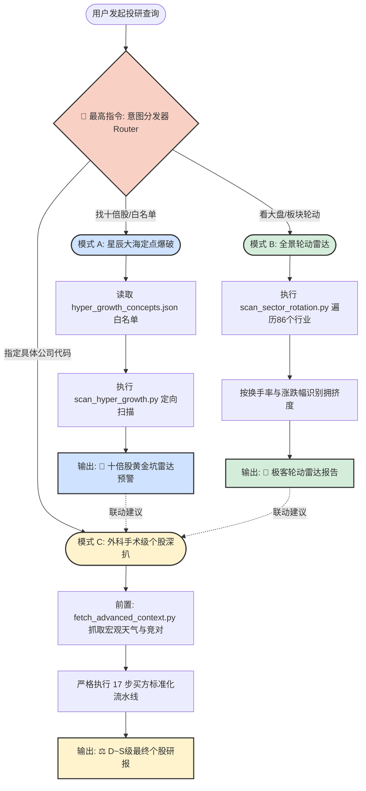

<div align="center">

# 🔎 机构级 A/H 股买方投研智能体 (Company Researcher)
### —— 个人投资者的专属量化与基本面决策中枢

**“不仅是发现好公司，更是发现好机会。自上而下看宏观大势，自下而上看资金微操。”**


</div>

---

## 📖 导读：v4.3 终极重构（单技能库·多工作流）

在高度博弈的 A 股与港股市场，单纯死磕个股基本面往往会因为“系统性大跌（宏观逆风）”或“买入过早（高潮站岗）”而惨败。
v4.3 版本完成了从“纯外科手术（个股深扒）”到“全维度量化（宏观+中观+微观）”的终极蜕变。系统现已内嵌**三大工作流**，通过自然语言自动路由分发。

---

## 🌟 系统全景运行流程图 (Workflow)


```mermaid
graph TD
    A([用户发起投研查询]) --> B{🔴 最高指令: 意图分发器 Router}
    
    B -- "找十倍股/白名单" --> C([模式 A: 星辰大海定点爆破])
    C --> C1[读取 hyper_growth_concepts.json 白名单]
    C1 --> C2[执行 scan_hyper_growth.py 定向扫描]
    C2 --> C3[输出: 🚀 十倍股黄金坑雷达预警]
    
    B -- "看大盘/板块轮动" --> D([模式 B: 全景轮动雷达])
    D --> D1[执行 scan_sector_rotation.py 遍历86个行业]
    D1 --> D2[按换手率与涨跌幅识别拥挤度]
    D2 --> D3[输出: 🚁 极客轮动雷达报告]
    
    B -- "指定具体公司代码" --> E([模式 C: 外科手术级个股深扒])
    E --> E1[前置: fetch_advanced_context.py 抓取宏观天气与竞对]
    E1 --> E2[严格执行 17 步买方标准化流水线]
    E2 --> E3[输出: ⚖️ D~S级最终个股研报]
    
    C3 -.->|联动建议| E
    D3 -.->|联动建议| E
    
    classDef red fill:#f9d0c4,stroke:#333,stroke-width:2px;
    class B red;
    classDef blue fill:#cfe2ff,stroke:#333,stroke-width:2px;
    class C,C3 blue;
    classDef green fill:#d4edda,stroke:#333,stroke-width:2px;
    class D,D3 green;
    classDef yellow fill:#fff3cd,stroke:#333,stroke-width:2px;
    class E,E3 yellow;
```

## 🧠 三叉戟工作流详解

### 🚀 模式 A：星辰大海（超高速定点爆破）
专门针对未来 5 年具备 10 倍增长潜力的赛道（如人形机器人、固态电池、低空经济等）进行监控。
- **痛点解决**：避免扫描几百个无效概念被封 IP。
- **交易哲学**：好赛道 + 缩量大跌回踩生命线（20/60日线） = 黄金坑抄底。

### 🚁 模式 B：全景雷达（防高潮与左侧捕捉）
瞬间遍历东方财富 86 个细分行业实时盘口数据。
- **痛点解决**：让你第一时间坐上刚启动的板块，同时避开已经被游资炒到换手率畸变的“高潮陷阱”。

### ⚖️ 模式 C：个股外科手术（17 步铁血尽调）
包含基本面排雷、资金博弈判定、以及极其残酷的**红队攻击 (DeepSeek Expert CoT)**。
- **宏观前置拦截**：v4.3 引入了宏观气象台。如果 PMI 收缩且流动性极差，系统将亮起“暴风雨”红灯，强制剥夺 AI 给予周期/高估值标的 S 级评分的权力。

---

## 🚀 实战使用示例 (Prompts)

你可以直接用自然语言唤醒不同的工作流：

**🔥 示例 1：唤醒 [模式 A - 黄金坑探测]**
> “帮我扫一下十倍股星辰大海白名单，看看有没有缩量回踩 20 日线的黄金坑？”

**🔥 示例 2：唤醒 [模式 B - 全市场轮动]**
> “扫描全市场大盘板块，看看今天资金去哪了，有哪些严重拥挤的高潮预警？”

**🔥 示例 3：唤醒 [模式 C - 个股防幻觉深扒]**
> “深度调研 比亚迪 (002594)，请结合宏观天气和竞对估值，严格执行红队攻击打分。”

---

## 📂 架构地图与自定义优化指南 (v4.3)

```text
company-researcher/
├── SKILL.md                  # 🌟 主干宪法：Router 总闸与个股 17 步 SOP
├── README.md                 # 📖 备忘录：本文档说明书
├── config/
│   └── hyper_growth_concepts.json # 🗂️ 十倍股星辰大海白名单 (可自由配置)
├── china_market/
│   ├── macro_weather_framework.md # 📡 宏观气象台：根据 PMI 等测算天气并干预仓位
│   ├── sector_radar_framework.md  # 🚁 板块雷达：86 个行业全景拥挤度判定规则
│   ├── hyper_growth_framework.md  # 🚀 星辰大海：缩量龙回头与黄金坑判定规则
│   └── red_team_framework.md      # ⚔️ 攻击框架：中国市场专属的做空/避雷逻辑
├── scripts/                  
│   ├── fetch_advanced_context.py  # 🚀 宏观网关：基于 akshare 抓取 PMI、快讯、竞对
│   ├── scan_sector_rotation.py    # 🚁 扫描引擎：遍历东财行业 Spot 捕捉轮动
│   ├── scan_hyper_growth.py       # 🚀 爆破引擎：白名单定向扫描，支持 --support_ma 传参
│   ├── fetch_market_data.py       # 🚀 个股网关：抓取 K 线、资金流等基础事实源
│   └── render_dashboard.py        # 📊 渲染引擎：一键生成全自动个股研报看板
└── tracking/
    └── ledger.csv            # 📊 追踪回测：个股台账
```

## 📜 License
MIT License © nihong
