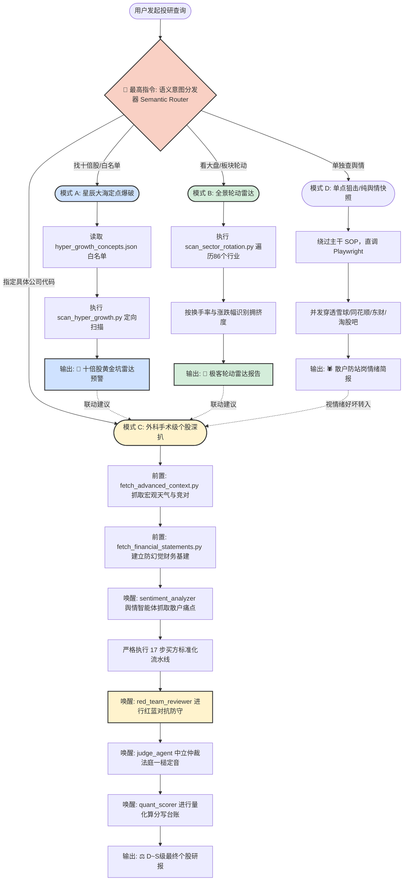

<div align="center">

# 🔎 机构级 A/H 股买方投研智能体 (Company Researcher)
### —— 个人投资者的专属量化与基本面决策中枢

**“不仅是发现好公司，更是发现好机会。自上而下看宏观大势，自下而上看资金微操。”**


</div>

---

## 📖 导读：v4.5 原生架构重构（买方级风控闭环）

在高度博弈的 A 股与港股市场，单纯死磕个股基本面往往会因为“系统性大跌”或“高潮站岗”而惨败。
v4.5 版本在原生专家智能体（Subagents）大军的基础上，完成了**买方级风控闭环**的彻底重构：**新增独立财报数据网关切断模型幻觉、引入仲裁法庭彻底解决红蓝对抗“和稀泥”、实装 T+1 尾盘建仓法与红灯无条件市价清仓的铁血纪律，以及基于资金量价背离和权重公式的深度反水军舆情穿透。**

---

## 🌟 系统全景运行流程图 (Workflow)


```mermaid
graph TD
    A([用户发起投研查询]) --> B{🔴 最高指令: 语义意图分发器 Semantic Router}
    
    B -- "找十倍股/白名单" --> C([模式 A: 星辰大海定点爆破])
    C --> C1[读取 hyper_growth_concepts.json 白名单]
    C1 --> C2[执行 scan_hyper_growth.py 定向扫描]
    C2 --> C3[输出: 🚀 十倍股黄金坑雷达预警]
    
    B -- "看大盘/板块轮动" --> D([模式 B: 全景轮动雷达])
    D --> D1[执行 scan_sector_rotation.py 遍历86个行业]
    D1 --> D2[按换手率与涨跌幅识别拥挤度]
    D2 --> D3[输出: 🚁 极客轮动雷达报告]
    
    B -- "指定具体公司代码" --> E([模式 C: 外科手术级个股深扒])
    E --> E1[前置: fetch_advanced_context.py 抓取宏观天气与竞对]
    E1 --> E1_1[前置: fetch_financial_statements.py 建立防幻觉财务基建]
    E1_1 --> E1_2[唤醒: sentiment_analyzer 舆情智能体抓取散户痛点]
    E1_2 --> E2[严格执行 17 步买方标准化流水线]
    E2 --> E3[唤醒: red_team_reviewer 进行红蓝对抗防守]
    E3 --> E3_1[唤醒: judge_agent 中立仲裁法庭一槌定音]
    E3_1 --> E4[唤醒: quant_scorer 进行量化算分写台账]
    E4 --> E5[输出: ⚖️ D~S级最终个股研报]
    
    B -- "单独查舆情" --> F([模式 D: 单点狙击/纯舆情快照])
    F --> F1[绕过主干 SOP，直调 Playwright]
    F1 --> F2[并发穿透雪球/同花顺/东财/淘股吧]
    F2 --> F3[输出: 🕷️ 散户防站岗情绪简报]
    
    C3 -.->|联动建议| E
    D3 -.->|联动建议| E
    F3 -.->|视情绪好坏转入| E
    
    classDef red fill:#f9d0c4,stroke:#333,stroke-width:2px;
    class B red;
    classDef blue fill:#cfe2ff,stroke:#333,stroke-width:2px;
    class C,C3 blue;
    classDef green fill:#d4edda,stroke:#333,stroke-width:2px;
    class D,D3 green;
    classDef yellow fill:#fff3cd,stroke:#333,stroke-width:2px;
    class E,E3 yellow;
```

## 🧠 三叉戟工作流详解

### 🚀 模式 A：星辰大海（超高速定点爆破）
专门针对未来 5 年具备 10 倍增长潜力的赛道（如人形机器人、固态电池、低空经济等）进行监控。
- **痛点解决**：避免扫描几百个无效概念被封 IP。
- **交易哲学**：好赛道 + 缩量大跌回踩生命线（20/60日线） = 黄金坑抄底。

### 🚁 模式 B：全景雷达（防高潮与左侧捕捉）
瞬间遍历东方财富 86 个细分行业实时盘口数据。
- **痛点解决**：让你第一时间坐上刚启动的板块，同时避开已经被游资炒到换手率畸变的“高潮陷阱”。

### ⚖️ 模式 C：个股外科手术（17 步铁血尽调）
包含基本面排雷、资金博弈判定、四大阵地舆情提取，以及极其残酷的**红蓝双向辩论 (Multi-Agent Debate)**。
- **物理级舆情穿透 (New)**：引入基于 Playwright 的无头浏览器引擎，强行穿透防火墙获取最真实的“反向指标”，并**实装 (点赞*2+评论) 权重算法**自动过滤水军。
- **财务基建网关 (New)**：新增原生财报接口，强制锁死营收与利润数据，彻底斩断大模型“无中生有”捏造业绩的幻觉可能。
- **原生大军并发对抗 (New)**：摒弃 opencli，唤醒原生红队 (`red_team_reviewer`) 与主分析师展开残酷质询。如果陷入僵局，将强制唤醒最高法院 **`judge_agent`** 进行“三局两胜”客观裁决，严禁蓝军用滞后的历史好财报去掩饰未来的周期见顶崩盘。
- **铁血防闷杀交易法则 (New)**：针对 A 股 T+1 制度，写入“尾盘建仓法”指令；并在资金灯亮起红灯（量价背离/天量长上影）时，严禁使用慢吞吞的分批清仓（TWAP），直接下达“次日 9:25 跌停价一键清仓”的止损死命令。

### 🕷️ 模式 D：单点狙击（纯舆情快照）
专门为打板族或左侧交易者准备的防御模块。不看财报，不看估值，只看散户情绪。
- **痛点解决**：买入前瞬间判断该股票是否处于散户“极度亢奋”的高潮站岗区，或者是“哀莫大于心死”的左侧无人问津区。

---

## 🚀 实战使用示例 (Prompts)

你可以直接用自然语言唤醒不同的工作流：

**🔥 示例 1：唤醒 [模式 A - 黄金坑探测]**
> “帮我扫一下十倍股星辰大海白名单，看看有没有缩量回踩 20 日线的黄金坑？”

**🔥 示例 2：唤醒 [模式 B - 全市场轮动]**
> “扫描全市场大盘板块，看看今天资金去哪了，有哪些严重拥挤的高潮预警？”

**🔥 示例 3：唤醒 [模式 C - 个股防幻觉深扒]**
> “深度调研 比亚迪 (002594)，请结合宏观天气和竞对估值，严格执行红队攻击打分。”

---

## 📂 架构地图与自定义优化指南 (v4.3)

```text
【1】代码与规则库 (Skill Repository)
📍 存放路径: ~/.gemini/config/skills/company-researcher/
├── SKILL.md                  # 🌟 主干宪法：Router 总闸与任务分发
├── README.md                 # 📖 备忘录：本文档说明书
├── agents/                   # 🧠 原生智能体人设池 (Antigravity Subagents)
│   ├── Red_Team_Review_Agent.md # 红军风控总监 (极限施压)
│   ├── Judge_Agent.md           # ⚖️ 中立仲裁法庭 (三局两胜决胜负)
│   ├── A_Share_Quant_Scorer.md  # 量化裁判长 (多模态算分写台账)
│   └── Sentiment_Analyzer.md    # 舆情分析师 (探测散户拥挤度)
├── workflows/                # ⚙️ 核心流水线编排
├── frameworks/               # 📚 统一理论知识库
│   ├── china_market/         # 🇨🇳 A股理论 (宏观天气、轮动雷达、红队规则等)
│   └── hk_market/            # 🇭🇰 港股理论
├── specs/                    # 📏 数据规范与骨架层
│   ├── report_template.md    # 买方研报填空防呆模板
│   ├── dashboard_rules.md    # 看板渲染规则
│   └── ledger_format.md      # 回测台账数据规范
├── config/
│   └── hyper_growth_concepts.json # 🗂️ 十倍股星辰大海白名单 (可自由配置)
└── scripts/                  
    ├── fetch_advanced_context.py  # 🚀 宏观网关：基于 akshare 抓取 PMI、快讯、竞对
    ├── fetch_financial_statements.py # 🏦 财务网关：抓取绝对真实的营收、净利润防幻觉
    ├── scan_sector_rotation.py    # 🚁 扫描引擎：遍历东财行业 Spot 捕捉轮动
    ├── scan_hyper_growth.py       # 🚀 爆破引擎：白名单定向扫描，支持 --support_ma 传参
    ├── fetch_market_data.py       # 🚀 个股网关：抓取 K 线、资金流等基础事实源
    ├── fetch_xueqiu_sentiment.py  # 🕷️ 舆情探针：基于 Playwright 带权重的反水军爬虫
    └── render_dashboard.py        # 📊 渲染引擎：一键生成全自动极客看板

【2】实体回测与研报库 (Workspace Repository)
📍 存放路径: ~/Documents/Github/Company_Research_Reports/
├── README.md                 # 🖥️ 极客看板主页：由 render_dashboard.py 全自动渲染
├── tracking/
│   ├── ledger.csv            # 📊 个股回测台账：记录所有个股的多空打分与评级
│   └── radar_ledger.csv      # 📊 宏观雷达台账：记录每日抓取的高潮预警与黄金坑板块
├── 00_Market_Radars/
│   ├── Sector_Rotation/      # 🚁 存放每日生成的《全市场动能雷达报告》
│   └── Hyper_Growth/         # 🚀 存放每日生成的《十倍股黄金坑雷达报告》
└── <各大细分行业目录>/         # ⚖️ 存放生成的个股深度研报 (例如: 汽车整车/002594_比亚迪.md)
```

## 📜 License
MIT License © nihong
